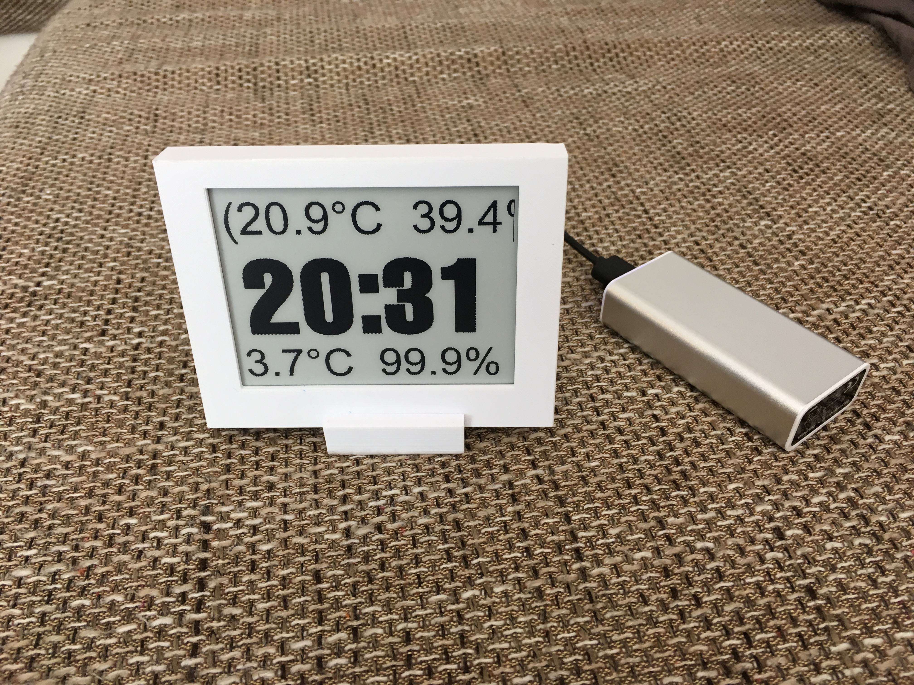
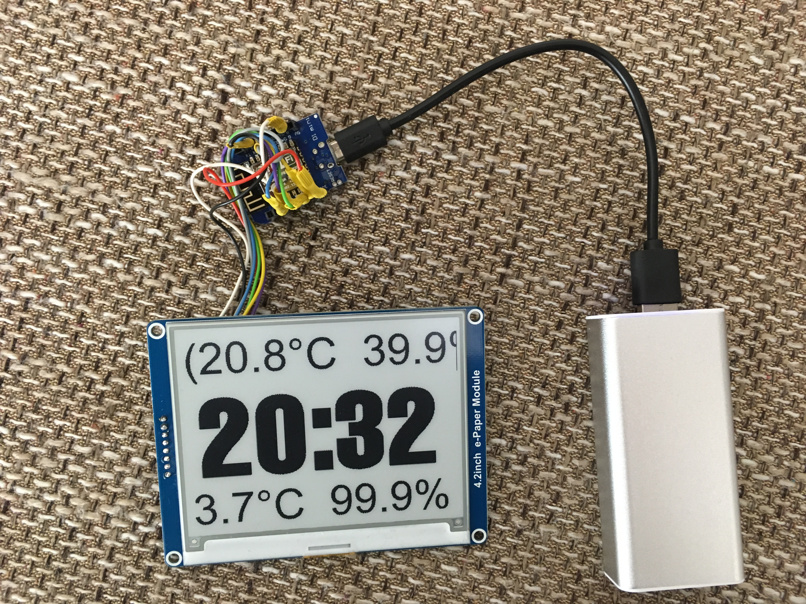
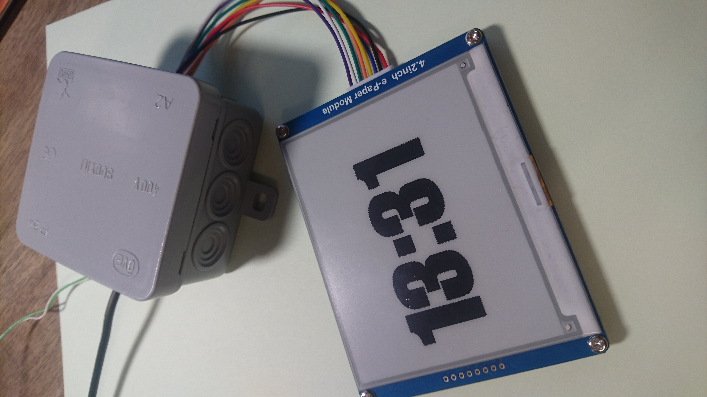
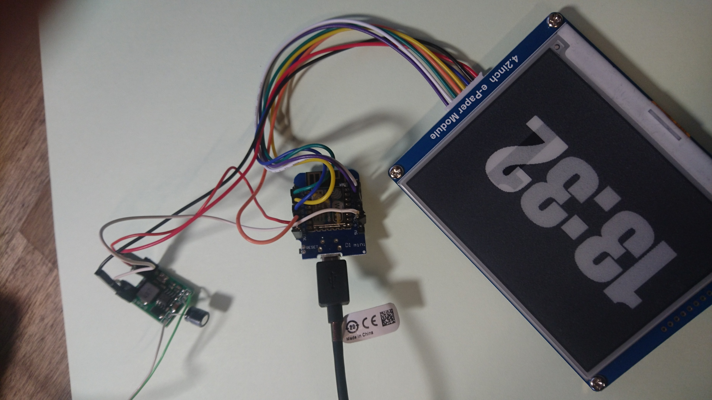
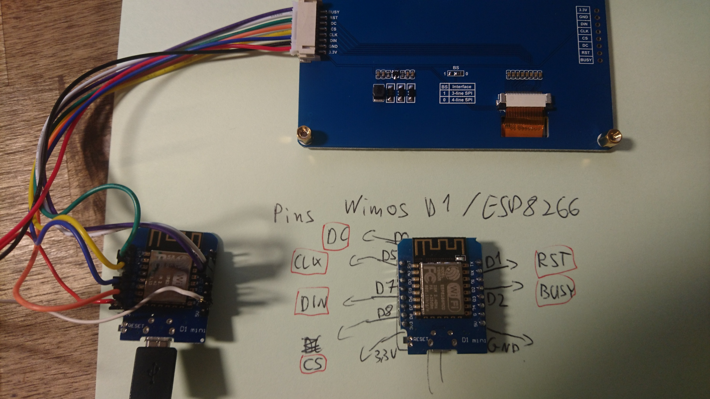

# e-ink-display-esp8266-mqtt-openwhisk
This repo contains code to control an e-ink module, connected to a WeMos D1 ESP8266 chip, from cloud functions on openWhisk using MQTT

## Overview

  e-ink display module --> ESP8266 --> MQTT --> Whisk actions
  

### Parts

You need only 2 parts to build a display like this yourself:

* WeMos D1 microcontroller or equiv. ESP8266 chip [https://www.ebay.com/itm/D1-Mini-NodeMcu-4M-bytes-Lua-WIFI-Development-Board-ESP8266-by-WeMos](https://www.ebay.com/itm/D1-Mini-NodeMcu-4M-bytes-Lua-WIFI-Development-Board-ESP8266-by-WeMos)
The WeMos D1 has USB built in which makes it very easy to program/power.

* E-Ink display. I used a Waveshare 4.2in display with SPI connection. [https://www.ebay.com/itm/4-2inch-E-Ink-Display-400x300-E-paper-Module-SPI-for-Raspberry-Pi-Arduino-STM32](https://www.ebay.com/itm/4-2inch-E-Ink-Display-400x300-E-paper-Module-SPI-for-Raspberry-Pi-Arduino-STM32)
Different brands and different conections may not be compatible with the Software in this repo.

* The power supply/regulator is optional. You can power it from USB.

## Arduino code for ESP8266 wifi microcontroller

* [arduino-esp8266-eink-display/](arduino-esp8266-eink-display/)

The arduino code runs on any generic ESP8266 module; here I use a WeMos D1. It has an included 5V->3.3V regulator and USB<>Serial converter for programming. 

It can be powered from USB and its 3.3V output supplies enough for the e-ink module. The photos also show a separate 3.3V regulator so that ESP and display can be powered externally by 4-20V.

The arduino code connects to a wifi then to an mqtt broker. There, it waits for messages containing pixel data as a byte array. The entire mqtt message payload must be pixel data black/white with 1 bit per pixel. Each byte/char represents 8 pixels. 

The Whisk actions will generate this byte array. So on the MQTT channel, we need support for a byte data-type and can't use pure Strings.

### Compiling Arduino code

* You need the ESP8266 "Board" plugin installed in your Arduino IDE
* Select the WeMos D1 board type and USB port
* Some libraries need to be installed acc. to include statements. You can use the Arduino library manager

#### Waveshare
The code uses some parts of the example library from Waveshare [https://www.waveshare.com/wiki/4.3inch_e-Paper_UART_Module](https://www.waveshare.com/wiki/4.3inch_e-Paper_UART_Module)

Only the interface to the display module is used and a whole frame (from mqtt) is always drawn at once. For these displays, the ESP8266 has enough memory to hold multiple full monochrome frames.

The library also includes basic drawing and text rendering directly on the ESP. For smaller microcontrollers, it has a simple partial framebuffer support.

# 3D printed case

You can find `STL` files for 3D printing the base/display case in `3d-print/`.

The designs can also be edited online on tinkercad.com:

* https://www.tinkercad.com/things/0IOFBVQCBK1-eink-clock-base/editv2
* https://www.tinkercad.com/things/iZ5w3NCEkOe-eink-clock1/editv2

# Whisk actions

The two whisk actions here provide clock-image rendering, and sending images to the display.
As a whisk secuence, together with a periodic trigger, they create the live clock display.

Between the two actions, the rendered image is exchanged within the messages as base64. This limits the possible image size depending on what limit we have in Whisk. Images here are few KBs, 15KB max.

## python send mqtt image

* [whisk_python_sendmqttimage/](whisk_python_sendmqttimage/)

This action is written in python and uses the paho mqtt library to send the pixel data to the esp. The action accepts a base64 encoded image (any format; png is used here) and brings it into the correct format for the e-ink display. Inside the action, the mqtt connection is configured.

## js make clock image

* [whisk_js_makeclock/](whisk_js_makeclock/)

This action uses the js library "Jimp" to render a PNG image with the current time. You can copy the resulting image-string into a browser address bar to preview the resulting image.

